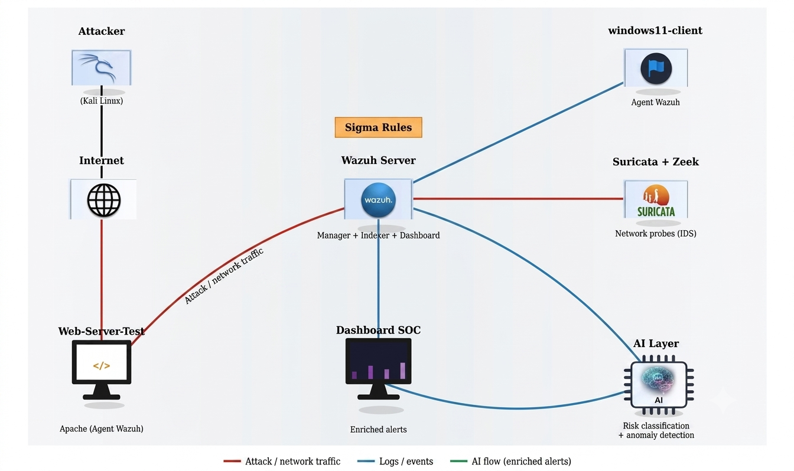

# AI-Enhanced SIEM with Wazuh

Welcome to my AI-Enhanced SIEM Lab repository!
This project documents my journey deploying, configuring, and enhancing a SIEM environment with an AI layer for smarter alert triage.

# 📌 Overview

This project demonstrates the end-to-end deployment and configuration of a SIEM environment using the open-source **Wazuh** platform, **Suricata** and **Zeek** for network detection, and a custom **AI layer** for alert classification and anomaly detection — built during a cybersecurity internship at **YaneCode Digital**.

# 🏗️ Lab Architecture

The lab is built using VMware Workstation VMs and includes the following components:

- **Wazuh Server**: Runs the central Wazuh Manager, Indexer, and Dashboard.
              Collects and correlates logs from agents, Suricata, and Zeek.
- **Windows Endpoint (Windows 11)**: Runs the Wazuh Agent for system monitoring and log forwarding.
- **Web Server (Ubuntu + Apache)**: Runs the Wazuh Agent, hosts Suricata and Zeek, and serves as the exposed target for attack simulations.
- **Attacker Machine (Kali Linux)**: Instance used to simulate threats against the web server.
- **Suricata IDS**: Monitors network traffic and sends IDS alerts to Wazuh.
- **Zeek**: Performs deep network traffic analysis and logging alongside Suricata.
- **AI Layer**: Classifies incoming alerts by risk level using an LLM, and flags abnormal behavior using an Isolation Forest model.

*Figure 1: SIEM Lab Architecture.*

# 🛠️ Wazuh Setup

**Summary:**
- Deploy Wazuh (Manager, Indexer, Dashboard) on a dedicated Ubuntu Server VM.
- Configure and troubleshoot Wazuh services, then access the Dashboard for monitoring.
- Install and register endpoint agents (Linux, Windows) to collect logs and centralize security visibility.

# 🔌 Implementation & Configuration

**Suricata Integration**

**Summary:**
- Install and configure Suricata on the web server VM, including interface binding and rule set tuning.
- Manage resource constraints (memory-limited lab VM) via swap and reduced rule sets/memcaps.
- Forward Suricata `eve.json` alerts to Wazuh through the local agent for centralized monitoring.

**Zeek Integration**

**Summary:**
- Deploy Zeek alongside Suricata on the web server VM for deep network traffic analysis.
- Forward Zeek connection logs to Wazuh through the local agent.

**Sigma Rules**

**Summary:**
- Study the Sigma rule format and structure across detection categories.
- Convert relevant Sigma rules into Wazuh-compatible detection rules.

**Syslog Ingestion**

**Summary:**
- Configure a Syslog listener on the Wazuh Manager to receive events from network-capable sources.

# 🤖 AI Layer: Alert Classification & Anomaly Detection

**Summary:**
- Classify incoming Wazuh alerts by risk level using an LLM, reducing analyst triage time.
- Detect abnormal behavior not covered by signature-based rules using an Isolation Forest model.
- Feed enriched, prioritized alerts back into the SOC dashboard workflow.

**Important:** all activities in this lab were performed exclusively in an isolated virtual environment (the VMs described above). Never run attack simulations against third-party or production systems.

# Conclusion

This SIEM lab project demonstrates how open-source tools can be combined with a custom AI layer to build a functional, intelligence-enhanced security monitoring environment. By integrating **Wazuh** as the central SIEM, **Suricata** and **Zeek** for network detection, and a dedicated **AI layer** (LLM classification + Isolation Forest anomaly detection), the lab goes beyond a traditional SIEM setup to address one of its biggest real-world challenges: alert fatigue.

Through hands-on deployment — including resource-constrained troubleshooting typical of a real lab environment — this project reinforced core SOC and detection-engineering skills: log collection architecture, rule tuning, Sigma-to-Wazuh conversion, and applying machine learning to security operations.

**Note:** This project is for educational purposes only, developed as part of an academic internship.

## 📄 Full Documentation

The complete project report (architecture, methodology, and results) is available in <<>>
## 📌 author

**Wissal EL BEKKALI**
